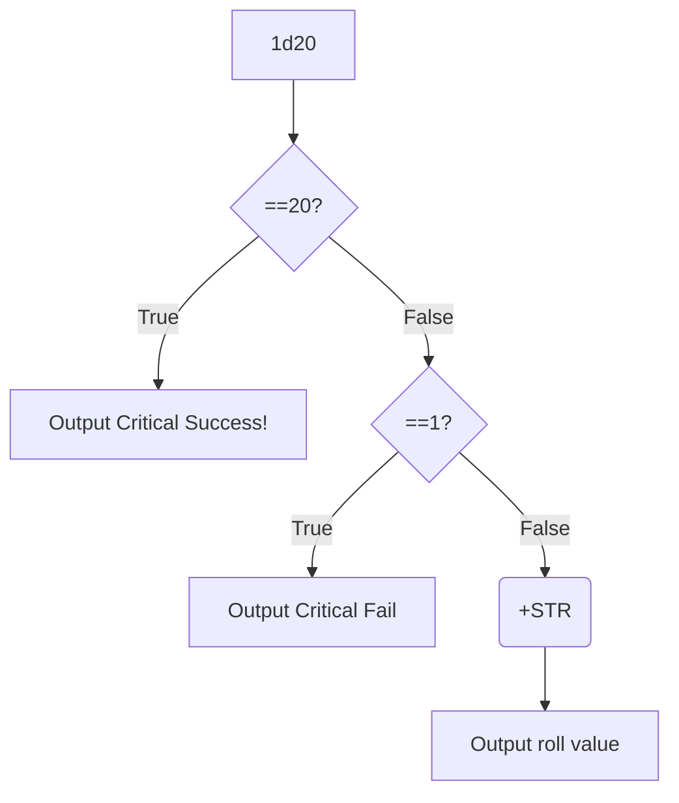
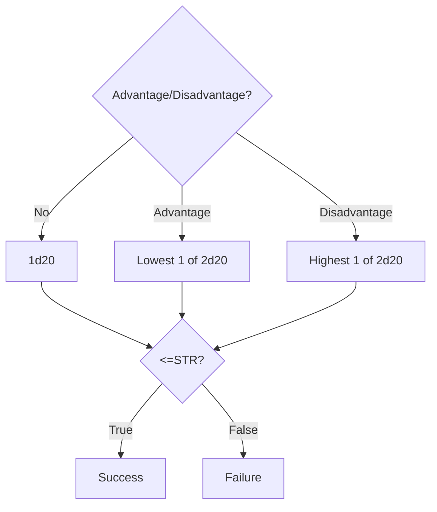

# Making My Own VTT

There is no VTT that I feel good about using. Like it or not every VTT
is designed as a platform not a piece of software, even the excellent
Foundry. The only exception being Maptool which is dated and Java based,
*yuck*. What I want is a VTT that is free and open-source, and adheres
to a Unix-esque philosophy. What the former means is that the software
itself is single purpose and easy to understand, with the ability to
make it more complicated via plugins.

Take for example the piece of software I am typing this in, NeoVIM. By
default it is a basic keyboard driven text editor, designed to have
the user never need to touch the mouse. But the advantage of NeoVIM is
you can make it more complicated with plugins. From basic plugins like
themes to full blown music players. The ammount it does past its most
basic function is up to you.

## Minimum Viable Product

The program by default should basically only handle putting tokens on
maps, allowing multiple users to network with each other and basic
permissions (ie separating GM and player). Everything else should be
a plugin. The features in this section would be core plugins, on by
default but able to be turned off if not needed, both globally and per
game.

### Maps

The obvious part is allowing for square, hex and gridless maps that you
can plop tokens onto. Where I think just a little bit of extra effort
would help is allowing map makers to package their image with some data.
Instead of maps just being a `png` or `jpg` they could also include a small
[YAML][yaml] file specifying the grid type, size and offset so that
everything is aligned on import. Package them in their own zip file with
a special file extension (like `cbz` for comics) and you have something
easily sharable for creators and that removes a big frustration for
GMs.

Map visibility should be handled by a simple, manually controlled fog
of war system. Automatic vision looks flashy but in practice it breaks
constantly and behaves unexpectedly. It ruins reveals, dungeon crawling
and flow at the table. It is much easier if the GM can just pick what
tiles are visible. Just let the GM drag a square to decide what is
visible. If GMs want a lighting system they'll need to make a plugin.

### Character Sheets

This is another area where I think should be dead simple and be a big
improvement on existing VTTs. Basic principle is that character sheet
templates should be easily creatable in a markup language, even just
markdown with some use specific syntax. Then you can describe stats and
macro buttons in sheets that are easily sharable and automatically conform
to the VTT's look and feel. This makes implementing new or niche systems
easy too.

### Dice rolling

Dice rolling syntax is already pretty well defined in other apps. So I
think the rub here is in the specifics. Variables like stats should be
easy to reference, defaulting to pulling from whoever made the roll.
So instead of referring to `self.mods.dex` it would be just `dex` making
it easier for most users to make a simple macro for common rolls.

## Wishlist features

With the list above, you would have a pretty solid VTT that would do
just about everything you truly *need*, so now let's talk about wants.
Extra little plugins that are disabled by default.

### Layers

The best feature of Roll20 is the layers. As a GM it means you can hide
tokens ahead of time only to reveal them all at once, put notes on the
damn map and do basic overlay effects. It's great and it could be better.
Imagine having complete control over what layers are available and
their visibility. You could have one GM layer just for notes, one for
ambushes and have multiple player layers to handle different elevations.
Way more elegant than more advanced systems and easily understood by
new users.

### Map building

Basically inbuilt tools for sketching out a map or dragging it together
from tiles. Think Dungeon Scrawl or HexKit, except integrating into the
map specific zip file idea from earlier. So now you can build and export
a map in a zip file that either includes all the assets, or if you can't
redistribute the assets references them in a redistributable way. You
could even use a different tile set.

### Styling

Chances are the styling of the app will be handled by CSS, so why not
let the users modify it. CSS as a technology would allow the layering
of styling. There can be a style defined for the system that could then
be overwritten by the users to their preferences. It also means those
with colour blindness, dyslexia or any other disability that might limit
accessibility can style their client to suit their needs.

### Visual Scripting

Not everyone knows how to code, and lack the sufficient blend of motivation
and probable autism to learn to do so. These people still need macros, so what
are they to do when the macro they need does not already exist. This
is where visual scripting comes in. Everyone understands a flow chart.
So instead of typing, users can assemble their macros out of predefined
operations that can be linked together in a flow chart.

For example here is a basic 5e roll:

and here is a Cairn roll:

### A Standalone App

The real issue with any of the DIY VTT solutions is you have to learn
how to host a server. Hell my Foundry setup uses Docker containers! No
normal person should have to learn containerisation. Instead it should
just be peer to peer more or less. Unlike multiplayer video games, TTRPGs
don't really incentivise cheating so why are we making tools that act
like they do? Players should just be able to run up the app, share a
code and start playing.

Additionally, I like single use tools. This trend of trying to be more
intentional by switching from the nightmare rectangles in our pockets
to a handful of purpose built things is nice. I want it to extend to
the digital gaming table as much as possible and that means getting
out of the web browser. It is way too easy to get distracted when you
are basically playing next to the open sewer of the internet.

[yaml]: https://yaml.org/about/
